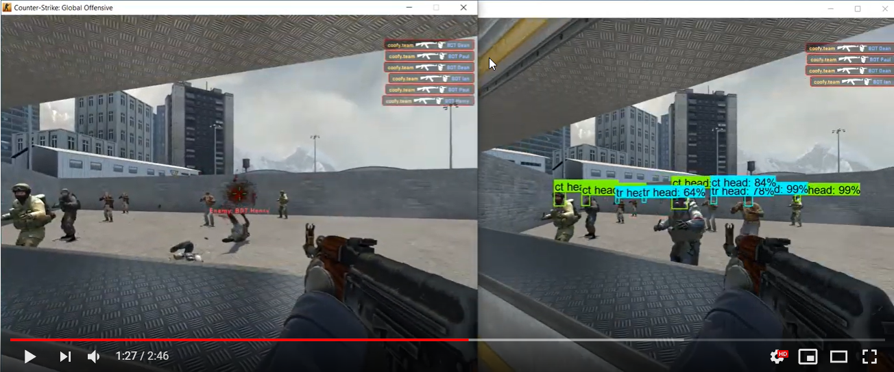

# Sight Bot

[](https://youtu.be/56ukHSWOtjg)

## Setup
```
Miniconda:

conda create -n perception-tf1.15 pip python=3.7 pyqt=5
```

#### Tensorflow
```
pip install tensorflow==1.15
```

#### PyAutoGUI
```
pip install pyautogui
```

#### Pynput
```
pip install pynput
```

#### object_detection
```
git clone --depth 1 https://github.com/tensorflow/models

cd models/research/
protoc object_detection/protos/*.proto --python_out=.
pip install .
```

#### OpenCV
```
pip install opencv-python
```

## Running
```
python main.py

# Force CPU
CUDA_VISIBLE_DEVICES=-1 python main.py
```
